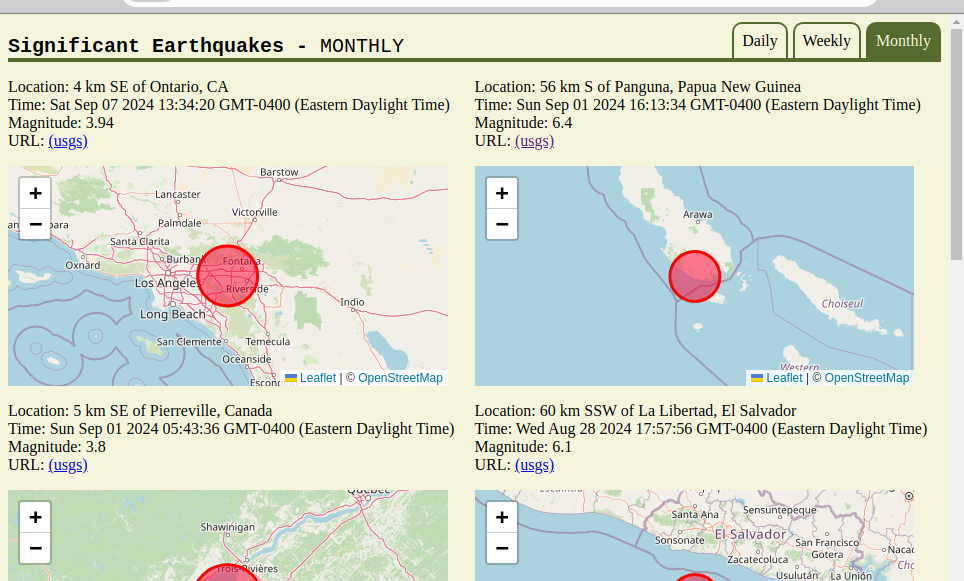
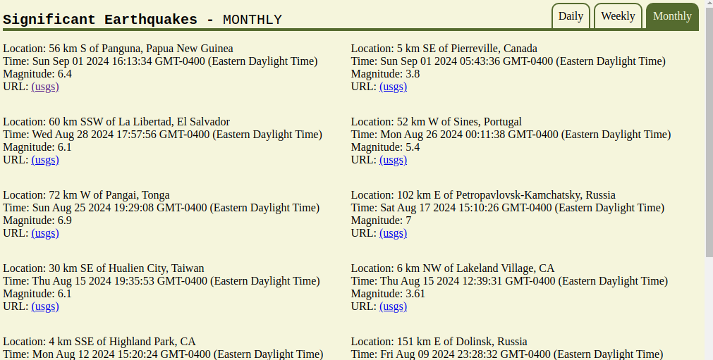

# USGS-Earthquake-tracker
__last updated (sept. 10, 2024)__

### Overview:
This Earthquake tracker is a simple web application that dynamically pulls the latest earthquake data from the US Geological Survey (usgs.gov) and displays the information in an orgainzed format on the page. A url back to the usgs page on the event is provided along with a map displaying the earthquake's location.

### Data Source: 
https://earthquake.usgs.gov/earthquakes/feed/v1.0/summary/significant_month.geojson

### Features:
1. The Location, Time, Magnitude and a URL to the USGS with more information is displayed in 2 or 3 columns (depending on the screen width). 
2. The default search period is from the past month. However, there are also options on the folder-like tabs to search for earthquakes in the last day and the last week.
3. Leaflet js is utilized to generate a map showing the location of the earthquake

### Project History

* Sept 5, 2024 - The initial iteration of the project. The overall goal was to take data from an external source and manipulate it into an interesting form.

